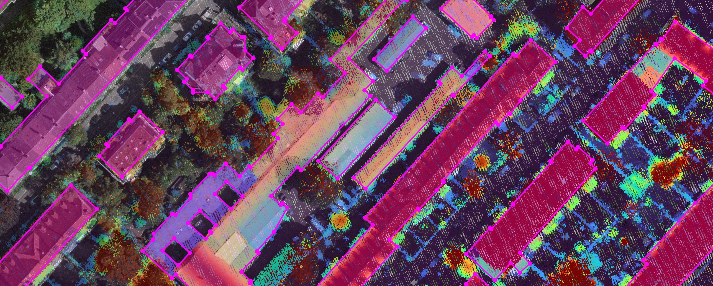

<div align="center">
    <h2 align="center">Pixels, Points, Polygons: A Global Dataset and Baseline for Multimodal Building Vectorization</h2>
    <!-- <h3 align="center">Arxiv</h3> -->
    <!-- <h3 align="center"><a href="https://raphaelsulzer.de/">Raphael Sulzer<sup>1,2</sup></a><br></h3> -->
    <h3><align="center">Raphael Sulzer<sup>1,2</sup></a></h3>
    <align="center"><sup>1</sup>LuxCarta   <sup>2</sup>Inria
    
    <b>Figure 1</b>: A view of our dataset of Zurich, Switzerland
</div>


<!-- [[Project Webpage]()]    [[Paper](https://arxiv.org/abs/2412.07899)]    [[Video]()] -->

## Abstract:

asd

## Highlights

- A global, multimodal dataset of aerial images, aerial lidar point clouds and building polygons
- A library for training and evaluating state-of-the-art deep learning methods on the dataset


## Dataset

### Numbers

#TODO put some images and numbers about the dataset

<!-- ### Properties -->

We provide train and val splits of the dataset in two different sizes 224 $\times$ 224 and 512 $\times$ 512. Both sized versions cover the same areas. The tiles of the test split have a fixed size of 2000 $\times$ 2000.

### Download

hugginface link

### Prepare custom tile size

See [datasets preprocessing](data_preprocess) for instructions on preparing a dataset with different tile sizes.


## Requirements

To create a conda environment named `ppp` and install the repository as a python package with all dependencies run
```
bash install.sh
```

or, if you want to manage the environment yourself run
```
pip install -r requirements-torch-cuda.txt
pip install .
```
⚠️ **Warning**: The implementation of the LiDAR point cloud encoder uses Open3D-ML. Currently, Open3D-ML officially only supports the PyTorch version specified in `requirements-torch-cuda.txt`.


## Model Zoo


| Model                     | \<model>  | Encoder                   | \<encoder>            |Image  |LiDAR  | IoU       | C-IoU     |
|---------------            |----       |---------------            |---------------        |---    |---    |-----      |-----       |
| Frame Field Learning      |\<ffl>     | Vision Transformer (ViT)  | \<vit_cnn>            | ✅    |       | 0.85      | 0.90      |
| Frame Field Learning      |\<ffl>     | PointPillars (PP) + ViT   | \<pp_vit_cnn>         |       | ✅    | 0.80      | 0.88      |
| Frame Field Learning      |\<ffl>     | PP+ViT \& ViT             | \<fusion_vit_cnn>     | ✅    |✅     | 0.78      | 0.85      |
| HiSup                     |\<hisup>   | Vision Transformer (ViT)  | \<vit_cnn>            | ✅    |       | 0.85      | 0.90      |
| HiSup                     |\<hisup>   | PointPillars (PP) + ViT   | \<pp_vit_cnn>         |       | ✅    | 0.80      | 0.88      |
| HiSup                     |\<hisup>   | PP+ViT \& ViT             | \<fusion_vit>         | ✅    |✅     | 0.78      | 0.85      |
| Pix2Poly                  |\<pix2poly>| Vision Transformer (ViT)  | \<vit>                | ✅    |       | 0.85      | 0.90      |
| Pix2Poly                  |\<pix2poly>| PointPillars (PP) + ViT   | \<pp_vit>             |       | ✅    | 0.80      | 0.88      |
| Pix2Poly                  |\<pix2poly>| PP+ViT \& ViT             | \<fusion_vit>         | ✅    |✅     | 0.78      | 0.85      |

## Configuration

The project supports hydra configuration which allows to modify any parameter from the command line.
To view all available options run
```
python train.py --help
```

## Training

Start training with the following command:

```
torchrun --nproc_per_node=<num GPUs> train.py model=<model> encoder=<encoder> model.batch_size=<batch size> ...

```

## Prediction

```
torchrun --nproc_per_node=<num GPUs> predict.py model=<model> checkpoint=best_val_iou ...

```

## Evaluation

```
python evaluate.py model=<model> checkpoint=best_val_iou
```
<!-- ## Trained models

asd -->


<!-- ## Results

#TODO Put paper main results table here -->


## Citation

If you find our work useful, please consider citing:
```bibtex
...
```

## Acknowledgements

This repository benefits from the following open-source work. We thank the authors for their great work.

1. [Frame Field Learning](https://github.com/Lydorn/Polygonization-by-Frame-Field-Learning)
2. [HiSup](https://github.com/SarahwXU/HiSup)
3. [Pix2Poly](https://github.com/yeshwanth95/Pix2Poly)
