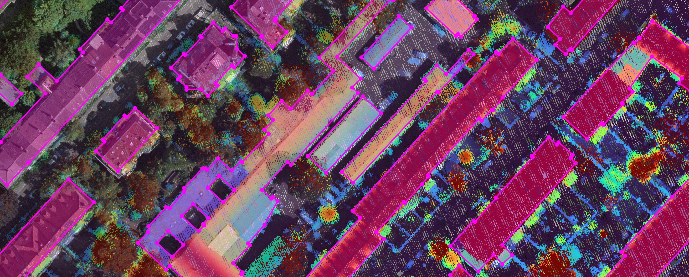
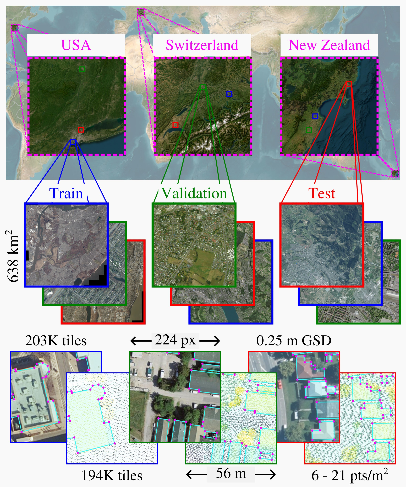

<div align="center">
    <h1 align="center">The P<sup>3</sup> dataset: Pixels, Points and Polygons <br> for Multimodal Building Vectorization</h1>
    <h3><align="center">Raphael Sulzer<sup>1,2</sup> &nbsp;&nbsp;&nbsp; Liuyun Duan<sup>1</sup>
    &nbsp;&nbsp;&nbsp; Nicolas Girard<sup>1</sup>&nbsp;&nbsp;&nbsp; Florent Lafarge<sup>2</sup></a></h3>
    <align="center"><sup>1</sup>LuxCarta Technology <br>  <sup>2</sup>Centre Inria d'Université Côte d'Azur
    
    <b>Figure 1</b>: A view of our dataset of Zurich, Switzerland
</div>

## Table of Contents

- [Abstract](#abstract)
- [Highlights](#highlights)
- [Dataset](#dataset)
- [Pretrained model weights](#pretrained-model-weights)
- [Code](#code)
- [Citation](#citation)
- [Acknowledgements](#acknowledgements)

## Abstract

<div align="justify">
We present the P<sup>3</sup> dataset, a large-scale multimodal benchmark for building vectorization, constructed from aerial LiDAR point clouds, high-resolution aerial imagery, and vectorized 2D building outlines, collected across three continents. The dataset contains over 10 billion LiDAR points with decimeter-level accuracy and RGB images at a ground sampling distance of 25 cm. While many existing datasets primarily focus on the image modality, P<sup>3</sup> offers a complementary perspective by also incorporating dense 3D information. We demonstrate that LiDAR point clouds serve as a robust modality for predicting building polygons, both in hybrid and end-to-end learning frameworks. Moreover, fusing aerial LiDAR and imagery further improves accuracy and geometric quality of predicted polygons. The P<sup>3</sup> dataset is publicly available, along with code and pretrained weights of three state-of-the-art models for building polygon prediction at https://github.com/raphaelsulzer/PixelsPointsPolygons.
</div>

## Highlights

- A global, multimodal dataset of aerial images, aerial LiDAR point clouds and building outline polygons, available at [huggingface.co/datasets/rsi/PixelsPointsPolygons](https://huggingface.co/datasets/rsi/PixelsPointsPolygons) 
- A library for training and evaluating state-of-the-art deep learning methods on the dataset, available at [github.com/raphaelsulzer/PixelsPointsPolygons](https://github.com/raphaelsulzer/PixelsPointsPolygons)
- Pretrained model weights, available at [huggingface.co/rsi/PixelsPointsPolygons](https://huggingface.co/rsi/PixelsPointsPolygons) 

## Dataset

### Overview

<div align="left">
    
</div>

### Download

The recommended and fastest way to download the dataset is to run

```
pip install huggingface_hub
python scripts/download_dataset.py --dataset-root $DATA_ROOT
```

Optionally you can also download the dataset by running

```
git lfs install
git clone https://huggingface.co/datasets/rsi/PixelsPointsPolygons $DATA_ROOT
```

Both options will download the full dataset, including aerial images (as .tif), aerial lidar point clouds (as .copc.laz) and building polygon annotaions (as MS-COCO .json) into `$DATA_ROOT` . The size of the dataset is around 163GB.

### Structure

<details>
<summary>📁 Click to expand dataset folder structure</summary -->

```text
PixelsPointsPolygons/data/224
├── annotations
│   ├── annotations_all_test.json
│   ├── annotations_all_train.json
│   └── annotations_all_val.json
│       ... (24 files total)
├── images
│   ├── train
│   │   ├── CH
│   │   │   ├── 0
│   │   │   │   ├── image0_CH_train.tif
│   │   │   │   ├── image1000_CH_train.tif
│   │   │   │   └── image1001_CH_train.tif
│   │   │   │       ... (5000 files total)
│   │   │   ├── 5000
│   │   │   │   ├── image5000_CH_train.tif
│   │   │   │   ├── image5001_CH_train.tif
│   │   │   │   └── image5002_CH_train.tif
│   │   │   │       ... (5000 files total)
│   │   │   └── 10000
│   │   │       ├── image10000_CH_train.tif
│   │   │       ├── image10001_CH_train.tif
│   │   │       └── image10002_CH_train.tif
│   │   │           ... (5000 files total)
│   │   │       ... (11 dirs total)
│   │   ├── NY
│   │   │   ├── 0
│   │   │   │   ├── image0_NY_train.tif
│   │   │   │   ├── image1000_NY_train.tif
│   │   │   │   └── image1001_NY_train.tif
│   │   │   │       ... (5000 files total)
│   │   │   ├── 5000
│   │   │   │   ├── image5000_NY_train.tif
│   │   │   │   ├── image5001_NY_train.tif
│   │   │   │   └── image5002_NY_train.tif
│   │   │   │       ... (5000 files total)
│   │   │   └── 10000
│   │   │       ├── image10000_NY_train.tif
│   │   │       ├── image10001_NY_train.tif
│   │   │       └── image10002_NY_train.tif
│   │   │           ... (5000 files total)
│   │   │       ... (11 dirs total)
│   │   └── NZ
│   │       ├── 0
│   │       │   ├── image0_NZ_train.tif
│   │       │   ├── image1000_NZ_train.tif
│   │       │   └── image1001_NZ_train.tif
│   │       │       ... (5000 files total)
│   │       ├── 5000
│   │       │   ├── image5000_NZ_train.tif
│   │       │   ├── image5001_NZ_train.tif
│   │       │   └── image5002_NZ_train.tif
│   │       │       ... (5000 files total)
│   │       └── 10000
│   │           ├── image10000_NZ_train.tif
│   │           ├── image10001_NZ_train.tif
│   │           └── image10002_NZ_train.tif
│   │               ... (5000 files total)
│   │           ... (11 dirs total)
│   ├── val
│   │   ├── CH
│   │   │   └── 0
│   │   │       ├── image0_CH_val.tif
│   │   │       ├── image100_CH_val.tif
│   │   │       └── image101_CH_val.tif
│   │   │           ... (529 files total)
│   │   ├── NY
│   │   │   └── 0
│   │   │       ├── image0_NY_val.tif
│   │   │       ├── image100_NY_val.tif
│   │   │       └── image101_NY_val.tif
│   │   │           ... (529 files total)
│   │   └── NZ
│   │       └── 0
│   │           ├── image0_NZ_val.tif
│   │           ├── image100_NZ_val.tif
│   │           └── image101_NZ_val.tif
│   │               ... (529 files total)
│   └── test
│       ├── CH
│       │   ├── 0
│       │   │   ├── image0_CH_test.tif
│       │   │   ├── image1000_CH_test.tif
│       │   │   └── image1001_CH_test.tif
│       │   │       ... (5000 files total)
│       │   ├── 5000
│       │   │   ├── image5000_CH_test.tif
│       │   │   ├── image5001_CH_test.tif
│       │   │   └── image5002_CH_test.tif
│       │   │       ... (5000 files total)
│       │   └── 10000
│       │       ├── image10000_CH_test.tif
│       │       ├── image10001_CH_test.tif
│       │       └── image10002_CH_test.tif
│       │           ... (4400 files total)
│       ├── NY
│       │   ├── 0
│       │   │   ├── image0_NY_test.tif
│       │   │   ├── image1000_NY_test.tif
│       │   │   └── image1001_NY_test.tif
│       │   │       ... (5000 files total)
│       │   ├── 5000
│       │   │   ├── image5000_NY_test.tif
│       │   │   ├── image5001_NY_test.tif
│       │   │   └── image5002_NY_test.tif
│       │   │       ... (5000 files total)
│       │   └── 10000
│       │       ├── image10000_NY_test.tif
│       │       ├── image10001_NY_test.tif
│       │       └── image10002_NY_test.tif
│       │           ... (4400 files total)
│       └── NZ
│           ├── 0
│           │   ├── image0_NZ_test.tif
│           │   ├── image1000_NZ_test.tif
│           │   └── image1001_NZ_test.tif
│           │       ... (5000 files total)
│           ├── 5000
│           │   ├── image5000_NZ_test.tif
│           │   ├── image5001_NZ_test.tif
│           │   └── image5002_NZ_test.tif
│           │       ... (5000 files total)
│           └── 10000
│               ├── image10000_NZ_test.tif
│               ├── image10001_NZ_test.tif
│               └── image10002_NZ_test.tif
│                   ... (4400 files total)
├── lidar
│   ├── train
│   │   ├── CH
│   │   │   ├── 0
│   │   │   │   ├── lidar0_CH_train.copc.laz
│   │   │   │   ├── lidar1000_CH_train.copc.laz
│   │   │   │   └── lidar1001_CH_train.copc.laz
│   │   │   │       ... (5000 files total)
│   │   │   ├── 5000
│   │   │   │   ├── lidar5000_CH_train.copc.laz
│   │   │   │   ├── lidar5001_CH_train.copc.laz
│   │   │   │   └── lidar5002_CH_train.copc.laz
│   │   │   │       ... (5000 files total)
│   │   │   └── 10000
│   │   │       ├── lidar10000_CH_train.copc.laz
│   │   │       ├── lidar10001_CH_train.copc.laz
│   │   │       └── lidar10002_CH_train.copc.laz
│   │   │           ... (5000 files total)
│   │   │       ... (11 dirs total)
│   │   ├── NY
│   │   │   ├── 0
│   │   │   │   ├── lidar0_NY_train.copc.laz
│   │   │   │   ├── lidar10_NY_train.copc.laz
│   │   │   │   └── lidar1150_NY_train.copc.laz
│   │   │   │       ... (1071 files total)
│   │   │   ├── 5000
│   │   │   │   ├── lidar5060_NY_train.copc.laz
│   │   │   │   ├── lidar5061_NY_train.copc.laz
│   │   │   │   └── lidar5062_NY_train.copc.laz
│   │   │   │       ... (2235 files total)
│   │   │   └── 10000
│   │   │       ├── lidar10000_NY_train.copc.laz
│   │   │       ├── lidar10001_NY_train.copc.laz
│   │   │       └── lidar10002_NY_train.copc.laz
│   │   │           ... (4552 files total)
│   │   │       ... (11 dirs total)
│   │   └── NZ
│   │       ├── 0
│   │       │   ├── lidar0_NZ_train.copc.laz
│   │       │   ├── lidar1000_NZ_train.copc.laz
│   │       │   └── lidar1001_NZ_train.copc.laz
│   │       │       ... (5000 files total)
│   │       ├── 5000
│   │       │   ├── lidar5000_NZ_train.copc.laz
│   │       │   ├── lidar5001_NZ_train.copc.laz
│   │       │   └── lidar5002_NZ_train.copc.laz
│   │       │       ... (5000 files total)
│   │       └── 10000
│   │           ├── lidar10000_NZ_train.copc.laz
│   │           ├── lidar10001_NZ_train.copc.laz
│   │           └── lidar10002_NZ_train.copc.laz
│   │               ... (4999 files total)
│   │           ... (11 dirs total)
│   ├── val
│   │   ├── CH
│   │   │   └── 0
│   │   │       ├── lidar0_CH_val.copc.laz
│   │   │       ├── lidar100_CH_val.copc.laz
│   │   │       └── lidar101_CH_val.copc.laz
│   │   │           ... (529 files total)
│   │   ├── NY
│   │   │   └── 0
│   │   │       ├── lidar0_NY_val.copc.laz
│   │   │       ├── lidar100_NY_val.copc.laz
│   │   │       └── lidar101_NY_val.copc.laz
│   │   │           ... (529 files total)
│   │   └── NZ
│   │       └── 0
│   │           ├── lidar0_NZ_val.copc.laz
│   │           ├── lidar100_NZ_val.copc.laz
│   │           └── lidar101_NZ_val.copc.laz
│   │               ... (529 files total)
│   └── test
│       ├── CH
│       │   ├── 0
│       │   │   ├── lidar0_CH_test.copc.laz
│       │   │   ├── lidar1000_CH_test.copc.laz
│       │   │   └── lidar1001_CH_test.copc.laz
│       │   │       ... (5000 files total)
│       │   ├── 5000
│       │   │   ├── lidar5000_CH_test.copc.laz
│       │   │   ├── lidar5001_CH_test.copc.laz
│       │   │   └── lidar5002_CH_test.copc.laz
│       │   │       ... (5000 files total)
│       │   └── 10000
│       │       ├── lidar10000_CH_test.copc.laz
│       │       ├── lidar10001_CH_test.copc.laz
│       │       └── lidar10002_CH_test.copc.laz
│       │           ... (4400 files total)
│       ├── NY
│       │   ├── 0
│       │   │   ├── lidar0_NY_test.copc.laz
│       │   │   ├── lidar1000_NY_test.copc.laz
│       │   │   └── lidar1001_NY_test.copc.laz
│       │   │       ... (4964 files total)
│       │   ├── 5000
│       │   │   ├── lidar5000_NY_test.copc.laz
│       │   │   ├── lidar5001_NY_test.copc.laz
│       │   │   └── lidar5002_NY_test.copc.laz
│       │   │       ... (4953 files total)
│       │   └── 10000
│       │       ├── lidar10000_NY_test.copc.laz
│       │       ├── lidar10001_NY_test.copc.laz
│       │       └── lidar10002_NY_test.copc.laz
│       │           ... (4396 files total)
│       └── NZ
│           ├── 0
│           │   ├── lidar0_NZ_test.copc.laz
│           │   ├── lidar1000_NZ_test.copc.laz
│           │   └── lidar1001_NZ_test.copc.laz
│           │       ... (5000 files total)
│           ├── 5000
│           │   ├── lidar5000_NZ_test.copc.laz
│           │   ├── lidar5001_NZ_test.copc.laz
│           │   └── lidar5002_NZ_test.copc.laz
│           │       ... (5000 files total)
│           └── 10000
│               ├── lidar10000_NZ_test.copc.laz
│               ├── lidar10001_NZ_test.copc.laz
│               └── lidar10002_NZ_test.copc.laz
│                   ... (4400 files total)
└── ffl
    ├── train
    │   ├── CH
    │   │   ├── 0
    │   │   │   ├── image0_CH_train.pt
    │   │   │   ├── image1000_CH_train.pt
    │   │   │   └── image1001_CH_train.pt
    │   │   │       ... (5000 files total)
    │   │   ├── 5000
    │   │   │   ├── image5000_CH_train.pt
    │   │   │   ├── image5001_CH_train.pt
    │   │   │   └── image5002_CH_train.pt
    │   │   │       ... (5000 files total)
    │   │   └── 10000
    │   │       ├── image10000_CH_train.pt
    │   │       ├── image10001_CH_train.pt
    │   │       └── image10002_CH_train.pt
    │   │           ... (5000 files total)
    │   │       ... (11 dirs total)
    │   ├── NY
    │   │   ├── 0
    │   │   │   ├── image0_NY_train.pt
    │   │   │   ├── image1000_NY_train.pt
    │   │   │   └── image1001_NY_train.pt
    │   │   │       ... (5000 files total)
    │   │   ├── 5000
    │   │   │   ├── image5000_NY_train.pt
    │   │   │   ├── image5001_NY_train.pt
    │   │   │   └── image5002_NY_train.pt
    │   │   │       ... (5000 files total)
    │   │   └── 10000
    │   │       ├── image10000_NY_train.pt
    │   │       ├── image10001_NY_train.pt
    │   │       └── image10002_NY_train.pt
    │   │           ... (5000 files total)
    │   │       ... (11 dirs total)
    │   ├── NZ
    │   │   ├── 0
    │   │   │   ├── image0_NZ_train.pt
    │   │   │   ├── image1000_NZ_train.pt
    │   │   │   └── image1001_NZ_train.pt
    │   │   │       ... (5000 files total)
    │   │   ├── 5000
    │   │   │   ├── image5000_NZ_train.pt
    │   │   │   ├── image5001_NZ_train.pt
    │   │   │   └── image5002_NZ_train.pt
    │   │   │       ... (5000 files total)
    │   │   └── 10000
    │   │       ├── image10000_NZ_train.pt
    │   │       ├── image10001_NZ_train.pt
    │   │       └── image10002_NZ_train.pt
    │   │           ... (5000 files total)
    │   │       ... (11 dirs total)
    │   ├── processed-flag-all
    │   ├── processed-flag-CH
    │   └── processed-flag-NY
    │       ... (8 files total)
    ├── val
    │   ├── CH
    │   │   └── 0
    │   │       ├── image0_CH_val.pt
    │   │       ├── image100_CH_val.pt
    │   │       └── image101_CH_val.pt
    │   │           ... (529 files total)
    │   ├── NY
    │   │   └── 0
    │   │       ├── image0_NY_val.pt
    │   │       ├── image100_NY_val.pt
    │   │       └── image101_NY_val.pt
    │   │           ... (529 files total)
    │   ├── NZ
    │   │   └── 0
    │   │       ├── image0_NZ_val.pt
    │   │       ├── image100_NZ_val.pt
    │   │       └── image101_NZ_val.pt
    │   │           ... (529 files total)
    │   ├── processed-flag-all
    │   ├── processed-flag-CH
    │   └── processed-flag-NY
    │       ... (8 files total)
    └── test
        ├── CH
        │   ├── 0
        │   │   ├── image0_CH_test.pt
        │   │   ├── image1000_CH_test.pt
        │   │   └── image1001_CH_test.pt
        │   │       ... (5000 files total)
        │   ├── 5000
        │   │   ├── image5000_CH_test.pt
        │   │   ├── image5001_CH_test.pt
        │   │   └── image5002_CH_test.pt
        │   │       ... (5000 files total)
        │   └── 10000
        │       ├── image10000_CH_test.pt
        │       ├── image10001_CH_test.pt
        │       └── image10002_CH_test.pt
        │           ... (4400 files total)
        ├── NY
        │   ├── 0
        │   │   ├── image0_NY_test.pt
        │   │   ├── image1000_NY_test.pt
        │   │   └── image1001_NY_test.pt
        │   │       ... (5000 files total)
        │   ├── 5000
        │   │   ├── image5000_NY_test.pt
        │   │   ├── image5001_NY_test.pt
        │   │   └── image5002_NY_test.pt
        │   │       ... (5000 files total)
        │   └── 10000
        │       ├── image10000_NY_test.pt
        │       ├── image10001_NY_test.pt
        │       └── image10002_NY_test.pt
        │           ... (4400 files total)
        ├── NZ
        │   ├── 0
        │   │   ├── image0_NZ_test.pt
        │   │   ├── image1000_NZ_test.pt
        │   │   └── image1001_NZ_test.pt
        │   │       ... (5000 files total)
        │   ├── 5000
        │   │   ├── image5000_NZ_test.pt
        │   │   ├── image5001_NZ_test.pt
        │   │   └── image5002_NZ_test.pt
        │   │       ... (5000 files total)
        │   └── 10000
        │       ├── image10000_NZ_test.pt
        │       ├── image10001_NZ_test.pt
        │       └── image10002_NZ_test.pt
        │           ... (4400 files total)
        ├── processed-flag-all
        ├── processed-flag-CH
        └── processed-flag-NY
            ... (8 files total)
```

</details>

## Pretrained model weights

### Download

The recommended and fastest way to download the pretrained model weights is to run

```
python scripts/download_pretrained.py --model-root $MODEL_ROOT
```

Optionally you can also download the weights by running

```
git clone https://huggingface.co/rsi/PixelsPointsPolygons $MODEL_ROOT
```

Both options will download all checkpoints (as .pth) and results presented in the paper (as MS-COCO .json) into `$MODEL_ROOT` .

## Code

### Download

```
git clone https://github.com/raphaelsulzer/PixelsPointsPolygons
```

### Installation

To create a conda environment named `p3` and install the repository as a python package with all dependencies run
```
bash install.sh
```

or, if you want to manage the environment yourself run
```
pip install -r requirements-torch-cuda.txt
pip install .
```
⚠️ **Warning**: The implementation of the LiDAR point cloud encoder uses Open3D-ML. Currently, Open3D-ML officially only supports the PyTorch version specified in `requirements-torch-cuda.txt`.


<!-- ## Model Zoo


| Model                     | \<model>  | Encoder                   | \<encoder>            |Image  |LiDAR  | IoU       | C-IoU     |
|---------------            |----       |---------------            |---------------        |---    |---    |-----      |-----       |
| Frame Field Learning      |\<ffl>     | Vision Transformer (ViT)  | \<vit_cnn>            | ✅    |       | 0.85      | 0.90      |
| Frame Field Learning      |\<ffl>     | PointPillars (PP) + ViT   | \<pp_vit_cnn>         |       | ✅    | 0.80      | 0.88      |
| Frame Field Learning      |\<ffl>     | PP+ViT \& ViT             | \<fusion_vit_cnn>     | ✅    |✅     | 0.78      | 0.85      |
| HiSup                     |\<hisup>   | Vision Transformer (ViT)  | \<vit_cnn>            | ✅    |       | 0.85      | 0.90      |
| HiSup                     |\<hisup>   | PointPillars (PP) + ViT   | \<pp_vit_cnn>         |       | ✅    | 0.80      | 0.88      |
| HiSup                     |\<hisup>   | PP+ViT \& ViT             | \<fusion_vit>         | ✅    |✅     | 0.78      | 0.85      |
| Pix2Poly                  |\<pix2poly>| Vision Transformer (ViT)  | \<vit>                | ✅    |       | 0.85      | 0.90      |
| Pix2Poly                  |\<pix2poly>| PointPillars (PP) + ViT   | \<pp_vit>             |       | ✅    | 0.80      | 0.88      |
| Pix2Poly                  |\<pix2poly>| PP+ViT \& ViT             | \<fusion_vit>         | ✅    |✅     | 0.78      | 0.85      | -->

### Setup

The project supports hydra configuration which allows to modify any parameter either from a `.yaml` file or directly from the command line.

To setup the project structure we recommend to specify your `$DATA_ROOT` and `$MODEL_ROOT` in `config/host/default.yaml`.

To view all available configuration options run
```
python scripts/train.py --help
```


<!-- The most important parameters are described below:
<details>
<summary>CLI Parameters</summary>

```text
        ├── processed-flag-all
        ├── processed-flag-CH
        └── processed-flag-NY
            ... (8 files total)
```

</details> -->

### Predict a single tile

TODO

```
python scripts/predict_demo.py
```

### Reproduce paper results

To reproduce the results from the paper you can run the following commands

```
python scripts/modality_ablation.py
python scripts/lidar_density_ablation.py
python scripts/all_countries.py
```

### Custom training, prediction and evaluation

We recommend to first setup a custom experiment file `$EXP_FILE` in `config/experiment/` following the structure of one of the existing files, e.g. `ffl_fusion.yaml`. You can then run

```
# train your model (on multiple GPUs)
torchrun --nproc_per_node=$NUM_GPU scripts/train.py experiment=$EXP_FILE

# predict the test set with your model (on multiple GPUs)
torchrun --nproc_per_node=$NUM_GPU scripts/predict.py experiment=$EXP_FILE evaluation=test checkpoint=best_val_iou

# evaluate your prediction of the test set
python scripts/evaluate.py model=<model> experiment=$EXP_FILE evaluation=test checkpoint=best_val_iou
```

You could also continue training from a provided pretrained model with

```
# train your model (on a single GPU)
python scripts/train.py experiment=p2p_fusion checkpoint=latest
```

## Citation

If you find our work useful, please consider citing:
```bibtex
TODO
```

## Acknowledgements

This repository benefits from the following open-source work. We thank the authors for their great work.

1. [Frame Field Learning](https://github.com/Lydorn/Polygonization-by-Frame-Field-Learning)
2. [HiSup](https://github.com/SarahwXU/HiSup)
3. [Pix2Poly](https://github.com/yeshwanth95/Pix2Poly)